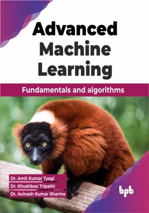

# Advanced Machine Learning

Our book explains learning algorithms related to real-world problems, with implementations in languages like R, Python, etc.

This is the repository for [Advanced Machine Learning
](https://bpbonline.com/products/advanced-machine-learning),published by BPB Publications.

## About the Book
Our book is divided into several useful concepts and techniques of machine learning. This book serves as a valuable resource for individuals seeking to deepen their understanding of advanced topics in this field. 

Learn about various learning algorithms, including supervised, unsupervised, and reinforcement learning, and their mathematical foundations. Discover the significance of feature engineering and selection for enhancing model performance. Understand model evaluation metrics like accuracy, precision, recall, and F1-score, along with techniques like cross-validation and grid search for model selection. Explore ensemble learning methods along with deep learning, unsupervised learning, time series analysis, and reinforcement learning techniques. Lastly, uncover real-world applications of the machine and deep learning algorithms.

After reading this book, readers will gain a comprehensive understanding of machine learning fundamentals and advanced techniques. With this knowledge, readers will be equipped to tackle real-world problems, make informed decisions, and develop innovative solutions using machine and deep learning algorithms.

## What You Will Learn
• Ability to tackle complex machine learning problems.

• Understanding of foundations, algorithms, ethical issues, and how to implement each learning algorithm for their own use/ with their data.

• Efficient data analysis for real-time data will be understood by researchers/ students.

• Using data analysis in near future topics and cutting-edge technologies.
